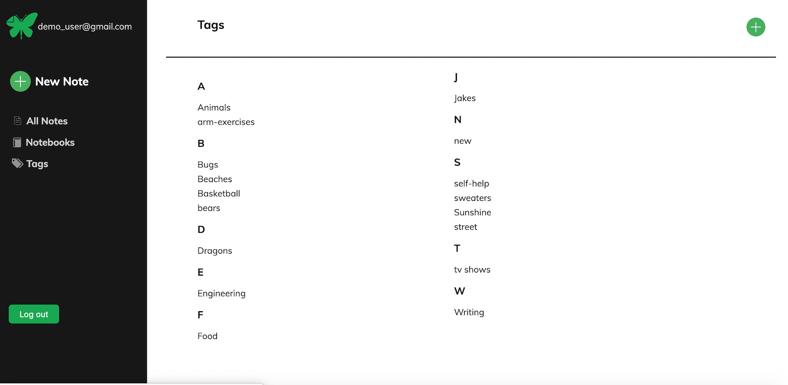

# README

[Everwrote](https://everwrote.herokuapp.com/Everwrote) is an Evernote clone built with React, Redux, Ruby-On-Rails and PostgreSQL.  Users can create notebooks and fill them with notes using imbedded font styling, images and links.


## Features
### • Secure user authentication<hr>

### • Create and edit notes in a rich text editor<hr>

### • Save and organize notes to notebooks<hr>

### • Add / Organize / Sort notes by custom tags.<hr>
<br><br>
<br>
### • Add custom tags to notes<hr>
<br>
### • Create & remove custom tags<hr>
<br>
### • Sort notes by tag<hr>
<br><br>
### • Filter notes by notebook, date created / updated, and title.


## Technologies
### Frontend

• REACT (JS library)<br>
• REDUX (state manager)<br>
• REACT-QUILL (rich text editor API)<br>
• AJAX 

### Backend
• RUBY ON RAILS<br>
• POSTGRESQL<br>
 

## Featured Highlights 
• New Notes custom routes functionality: <br>

Handling the proper render of clicking the "NEW NOTE" button was a challenge that
uses Regular Expressions to creatively solve.  The buttons effect needed to change depending on 
the current path. 

```javascript
if (/notebooks\/\d*/.test(ownProps.location.pathname)) {
    newNotePath = ownProps.location.pathname.replace(/\/\d+(?=\/notebooks\/\d+)/, "");
  } else {
     newNotePath = `/notes/notebooks/${notebooksArr[lastNbId].id}`;
  } 
```

