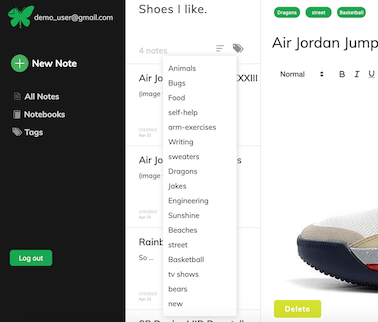

# README

[Everwrote](https://everwrote.herokuapp.com/Everwrote) is an Evernote clone built with React, Redux, Ruby-On-Rails and PostgreSQL.  Users can create notebooks and fill them with notes using imbedded font styling, images and links.


## Features
### • Secure user authentication<hr>

### • Create and edit notes in a rich text editor<hr>

### • Save and organize notes to notebooks<hr>

### • Add / Organize / Sort notes by custom tags.<hr>
<br><br>
<br>
### • Add custom tags to notes<hr>
<br>
### • Create & remove custom tags<hr>
<br>
### • Sort notes by tag<hr>
<br><br>
### • Filter notes by notebook, date created / updated, and title.


## Technologies
### Frontend

• REACT (JS library)<br>
• REDUX (state manager)<br>
• REACT-QUILL (rich text editor API)<br>
• AJAX 

### Backend
• RUBY ON RAILS<br>
• POSTGRESQL<br>
 

## Featured Highlights 
• New Notes custom routes functionality: <br>

Handling the proper render of clicking the "NEW NOTE" button was a challenge that
uses Regular Expressions to creatively solve.  The buttons effect needed to change depending on 
the current path. 

```javascript
if (/notebooks\/\d*/.test(ownProps.location.pathname)) {
    newNotePath = ownProps.location.pathname.replace(/\/\d+(?=\/notebooks\/\d+)/, "");
  } else {
     newNotePath = `/notes/notebooks/${notebooksArr[lastNbId].id}`;
  } 
```

• Mapping note objects to notebooks: <br><br>
When sorting notebooks by "updated", the updated date needed to reflect the most recent changes to the notebook object itself, OR, the most recent change with any note associated with the notebook.  This required to map the associated notes updated_at parameter of each notebook with the notebooks own updated_at parameter.

```javascript
mapUpdatedNoteToNotebook(notes){
    const collection = {};
    Object.values(notes.notes).forEach(note => {
      if(note.notebook_id in collection){
        collection[note.notebook_id].push(note);
        collection[note.notebook_id] = 
          collection[note.notebook_id][0].updated_at > collection[note.notebook_id][1].updated_at ? [ collection[note.notebook_id][0] ] : [ collection[note.notebook_id][1] ];
      } else {
        collection[note.notebook_id] = [ note ];
      }
    });
    const collectionArr = Object.values(collection).sort((a, b) => {new Date(b[0].updated_at) - new Date(a[0].updated_at)});
    const sortedNotebookIds = collectionArr.map(note => { return note[0].notebook_id });
    this.setState({
      updatedNotebookOrder: sortedNotebookIds,
      updatedNotesCollection: collection,
    });
  }

```
• Joins table creating 'association objects' to easily add / remove tags to notes<br><br>
When creating tags for notes, there is a one to many relationship where a tag can belong to multiple notes.  Removing a tag from one note, should not remove the tag from another.  Creating a joins table to represent the relationship allows for the tag object to be assigned to multiple notes and deleted without affecting the tag object itself.
```ruby
create_table "joins", force: :cascade do |t|
    t.integer "tag_id", null: false
    t.integer "note_id", null: false
    t.datetime "created_at", null: false
    t.datetime "updated_at", null: false
    t.index ["note_id"], name: "index_joins_on_note_id"
    t.index ["tag_id"], name: "index_joins_on_tag_id"
  end
  ```
## Future Features
• Sharable notes and notebooks between users<br>
• Messaging between users using Action Cable & Web Sockets<br>
• Simple trash can feature for deleted notes<br>
• Fullscreen expandable note editor<br>
• Downloadable notes & notebook collections in editable & pdf formats

